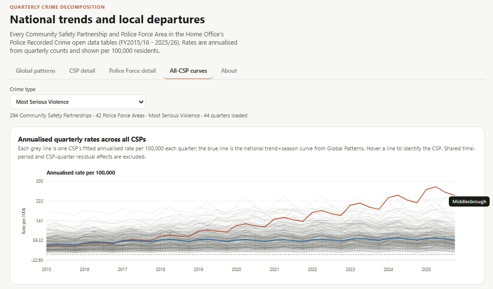

# Crime decomposition explorer (England & Wales replica)

An interactive explorer that decomposes Community Safety Partnership (CSP)
and Police Force Area (PFA) crime trends into trend, seasonal, and residual
components built on the structure of Andrew Wheeler's
[CrimeDecomp](https://github.com/apwheele/CrimeDecomp), adapted for Home
Office quarterly data covering England & Wales, FY2015/16–2025/26.

**[Live demo](https://routineactivity.github.io/interactive-chart/index.html)**

Every CSP and PFA gets its own fitted trend and seasonal deviation from a
national reference curve, so you can see at a glance whether a local area is
tracking the national pattern or diverging from it and where quarter-level
residuals suggest something happened beyond the seasonal norm.

## What's in the app

- **Global patterns** — national trend, seasonal effect, and shared
  time-period shocks (e.g. pandemic-affected quarters), for any of 20
  offence categories
- **CSP detail** — filter by Police Force Area, then drill into any single
  Community Safety Partnership: observed vs. fitted rate, trend/season/
  residual comparisons against the national curve with approximate
  confidence bands, and a full quarterly data table
- **Police Force detail** — the same decomposition at whole-force level
- **All-CSP curves** — all 299* CSPs overlaid against the national reference,
  hoverable, across rate/trend/season/residual views

*See Data caveats below

## Data sources

- [Police Recorded Crime open data tables](https://www.gov.uk/government/statistics/police-recorded-crime-open-data-tables) — Home Office, quarterly CSP/PFA-level offence counts
- [Population estimates](https://www.nomisweb.co.uk/sources/pest) — ONS, used to compute rates per 100,000 residents

## Requirements

- Python 3.9+
- `numpy`, `pandas`, `statsmodels`

    pip install numpy pandas statsmodels

## Data caveats

Several areas are excluded or merged to keep rates comparable (City of
London and Isles of Scilly excluded as extreme population outliers, several
CSPs merged/renamed to align with local-authority population boundaries,
four Kent CSPs excluded post-2024/25 due to a Home Office data assignment
issue). Full detail is in the app's About page — worth reading before
citing any single-area figure.

## Possible future work

- True mixed-effects model (partial pooling/shrinkage for small CSPs)
- Automated rebuild on data release (GitHub Action)

## License

Code in this repository is MIT licensed, see LICENSE.

Embedded crime and population data is Crown copyright, licensed under the
Open Government Licence v3.0, not under this repo's MIT license:
- Police recorded crime: © Crown copyright, Home Office
- Population estimates: © Crown copyright, Office for National Statistics
https://www.nationalarchives.gov.uk/doc/open-government-licence/version/3/

## Acknowledgments

Structure and methodology inspired by Andrew Wheeler's
[CrimeDecomp](https://github.com/apwheele/CrimeDecomp) (MIT licensed).